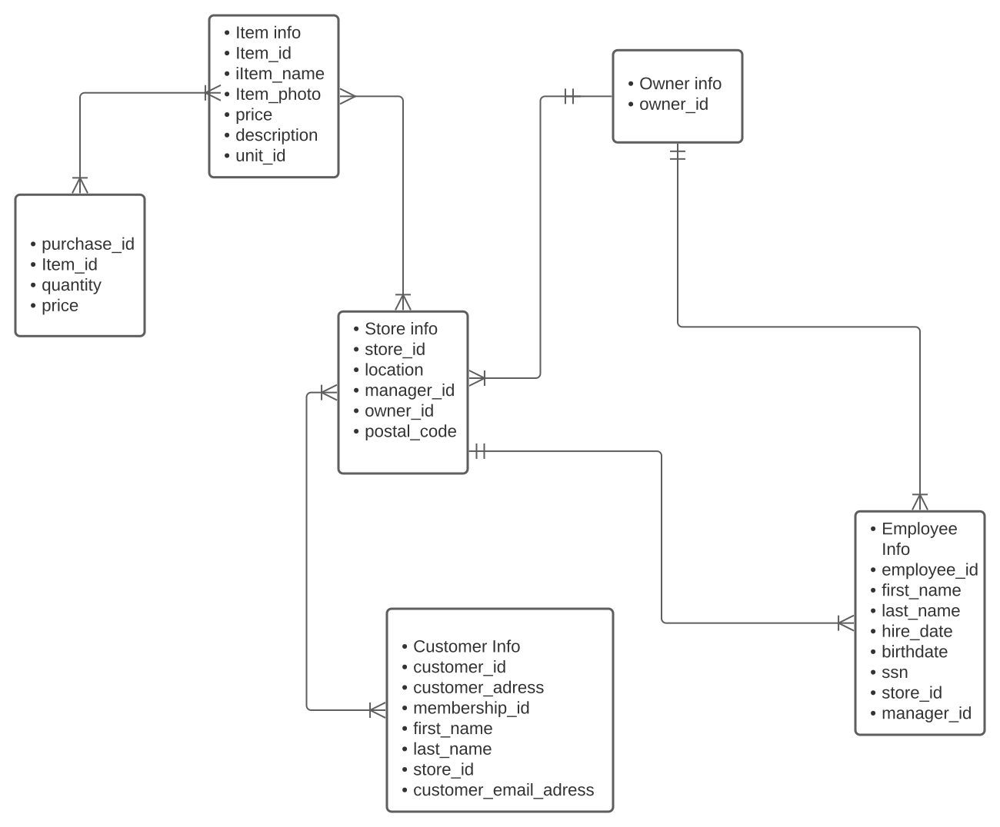

# week_7_group_activity
1. 

2. List of how Data can be "Dirty" and how to solve them. 
    1. Inaccurate data: misspelled, typographical errors, whitespaces. It can be mitigated by offering a spell-check functionality for data entry or creating a direct feed from another system to avoid manual data entry.  
    2. Irrelevant or incorrectly formatted data: for example, 13th month in a date or date in a wrong format. It can be avoided by creating validation rules in the data intake forms that only allow relevant and accurately formatted data to be entered such as limiting "month" to the range of "1-12" or by providing a calendar feature for the user to pull the date from instead of a "free form" field.
    3. Incomlete data: certain fields may be missing. For example, we may have all "last names", but only some of the "first names". It can be avoided by creating a validation rule and making all critical fields mandatory in the intake form.
    4. Duplicate data: several rows for the same record. They can be addressed by introducing a validation check in the intake form to ensure that entered values are not already in the database (e.g. if new user is trying to register with an email address already registered). 
    5. Inconsistent data: data in one table may contradict data in a different table. We can develop and run scripts that identify inconsistencies by scanning the tables in the database and highlight and potentially eliminate inconsistencies based on pre-defined rules.
    

3. API:
---Spoonacular Food Recipe Nutrition API - https://spoonacular.com/food-api

----Flight Tracking and Flight Status API - https://flightaware.com/commercial/aeroapi/